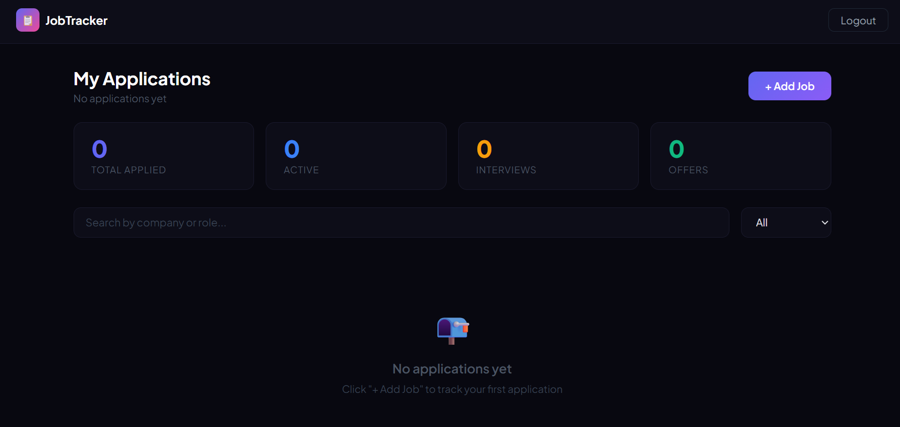

# 📋 Job Tracker

A full-stack web application to track job applications through every stage of the hiring process — from applied to offer.

**Live Demo:** [Link](https://job-tracker-frontend-red.vercel.app/)



---

## Features

- **Authentication** — secure register and login with JWT tokens, passwords hashed with bcrypt
- **Application Tracking** — add, edit, and delete job applications with company, role, location, salary, and notes
- **Status Pipeline** — track each application through Applied → Screening → Interview → Offer → Accepted / Rejected / Ghosted
- **Dashboard Analytics** — real-time stats showing total applications, active, interviews, and offers
- **Search & Filter** — filter by status or search by company and role
- **Persistent Sessions** — stay logged in across browser refreshes

---

## Tech Stack

**Frontend**

- React 19 with hooks (useState, useEffect, useContext)
- React Router v7 for client-side routing
- Axios for API requests
- Context API for global auth state

**Backend**

- Node.js + Express REST API
- MongoDB with Mongoose ODM
- JWT for authentication
- bcryptjs for password hashing

**Deployment**

- Frontend and backend deployed on Vercel
- Database hosted on MongoDB Atlas

---

## Getting Started Locally

### Prerequisites

- Node.js installed
- MongoDB Atlas account (free)

### Clone the repo

```bash
git clone https://github.com/rigopz/job-tracker.git
cd job-tracker
```

### Backend setup

```bash
cd backend
npm install
```

Create a `.env` file in `backend/`:

```
PORT=8000
MONGO_URI=your_mongodb_connection_string
JWT_SECRET=your_secret_key
```

```bash
npm run dev
```

### Frontend setup

```bash
cd frontend
npm install
npm run dev
```

Open `http://localhost:5173`

---

## Project Structure

```
job-tracker/
├── backend/
│   ├── config/        # Database connection
│   ├── controllers/   # Route logic
│   ├── middleware/     # JWT auth middleware
│   ├── models/        # Mongoose schemas
│   ├── routes/        # Express routers
│   └── server.js
└── frontend/
    └── src/
        ├── api/        # Axios instance
        ├── components/ # Navbar, JobCard, JobForm, StatsRow
        ├── context/    # Auth context
        └── pages/      # Login, Register, Dashboard
```

---

## API Endpoints

| Method | Endpoint             | Description           | Auth |
| ------ | -------------------- | --------------------- | ---- |
| POST   | `/api/auth/register` | Register a new user   | No   |
| POST   | `/api/auth/login`    | Login and get token   | No   |
| GET    | `/api/jobs`          | Get all jobs for user | Yes  |
| POST   | `/api/jobs`          | Create a new job      | Yes  |
| PUT    | `/api/jobs/:id`      | Update a job          | Yes  |
| DELETE | `/api/jobs/:id`      | Delete a job          | Yes  |
